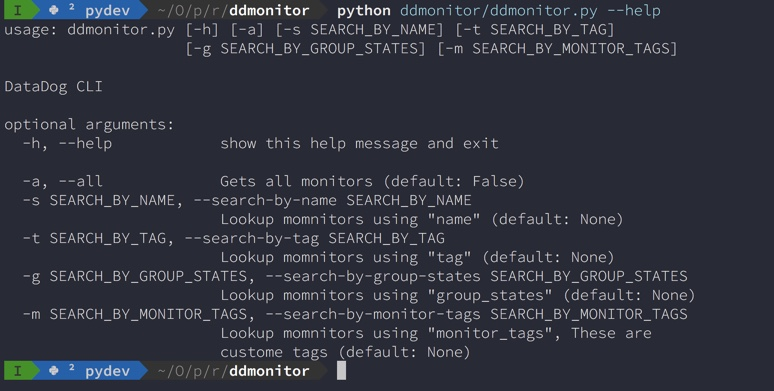

# ddmonitor
#### `ddmonitor` is a command line utility for **Datadog**.

`ddmonitor` is an attempt to communicate with **Datadog** `apis` using commandline. Presently it is a [WIP](https://github.com/apps/wip) initiative. Following has been implemented:

- Supports listing all the monitors created
- Supports searching monitors using `name`, `tags` and `status`.

[](https://github.com/kodelint/ddmonitor/blob/master/LICENSE)


#### Installation

```
$ python setup.py install

```
```
$ python ddmonitor.py [-h] [-a] [-n SEARCH_BY_NAME] [-s SEARCH_BY_STATUS]
                    [-t SEARCH_BY_TAGS]

DataDog CLI

optional arguments:
  -h, --help            show this help message and exit

  -a, --all             Gets all monitors (default: False)
  -n SEARCH_BY_NAME, --search-by-name SEARCH_BY_NAME
                        Lookup monitors using "name" (default: None)
  -s SEARCH_BY_STATUS, --search-by-status SEARCH_BY_STATUS
                        Lookup monitors using "group_states" (default: None)
  -t SEARCH_BY_TAGS, --search-by-tags SEARCH_BY_TAGS
                        Lookup monitors using "monitor_tags", These are
                        custome tags (default: None)
```

**OR**

```
git clone https://github.com/kodelint/ddmonitor.git
```

```
pip install -r requirements.txt
```

```
$ python ddmonitor/ddmonitor.py [-h] [-a] [-n SEARCH_BY_NAME] [-s SEARCH_BY_STATUS]
                    [-t SEARCH_BY_TAGS]

DataDog CLI

optional arguments:
  -h, --help            show this help message and exit

  -a, --all             Gets all monitors (default: False)
  -n SEARCH_BY_NAME, --search-by-name SEARCH_BY_NAME
                        Lookup monitors using "name" (default: None)
  -s SEARCH_BY_STATUS, --search-by-status SEARCH_BY_STATUS
                        Lookup monitors using "group_states" (default: None)
  -t SEARCH_BY_TAGS, --search-by-tags SEARCH_BY_TAGS
                        Lookup monitors using "monitor_tags", These are
                        custome tags (default: None)
```


Also we need keys to communicate with **datadog**. There are 2 ways provide `API` and `APP Keys`:

1. Create a configuration file `config.ini` in your `$HOME` directory and put the `API` nad `APP Keys`

```
cat ~/.ddmon.ini                                                                                                                                                                                                          3067ms
[default]
dd_api_key=XXXXXXXXXXXXXXXXXXXXXXX
dd_app_key=XXXXXXXXXXXXXXXXXXXXXXXXXXX
```

2. Setup environment variables in your `.bashrc` for `bash shell` or `.zshrc` for `zsh shell` or `config.fish` for `fish shell`.

```
export dd_api_key=XXXXXXXXXXXXXXXXXXXXXXX
export dd_app_key=XXXXXXXXXXXXXXXXXXXXXXXXXXX
```

`ddmonitor` will automatically lookup for one or another to grab the `API` and `APP` keys.

##### Screenshots:



##### Examples

**Search by Name**

```
$ python ddmonitor.py --search-by-name "Indexing_Pipeline_Leader"

[
  {
    "Creator": "Some Guy in Team",
    "Name": "Indexing_Pipeline",
    "Query": "avg(last_1m):avg:zk.instances.leader <= 0",
    "Status": "OK",
    "Tags": [
      "zk",
      "some_env"
    ]
  }
]
```

**Search by Tags**
```
$ python ddmonitor.py --all

{
    "Creator": "Some Guy in Team",
    "Name": "Indexing_Pipeline",
    "Query": "avg(last_1m):avg:zk.instances.leader <= 0",
    "Status": "OK",
    "Tags": [
    "Name": "Indexing_Pipeline",
    "Query": "avg(last_1m):avg:zk.instances.leader <= 0",
    "Status": "OK",
    "Tags": [
      "some_env"
    ]
  },
  ...
  ...
  ...
  ...

  {
    "Creator": "Some Guy in Team",
    "Name": "Indexing_Pipeline_Disk_Full",
    "Query": "avg(last_5m):avg:system.disk.used by {host,device} / avg:system.disk.total by {host,device} * 100 >= 90",
    "Status": "OK",
    "Tags": [
      "some_env"
    ]
  }
```


##### Dependencies:

`ddmonitor` depends on [datadogpy](https://github.com/DataDog/datadogpy). [datadogpy](https://github.com/DataDog/datadogpy) is **datadog's** official python library.


`ddmonitor` available options explained:


 | **Options** | **Definitions** |
 | ------------- | ------------- |
 | `-a` or `--all` |Dumps all the monitor created|
 | `-n` or `--search-by-name` |Search monitor using filter `name`|
 | `-s` or `--search-by-status`|Search monitor using filter `status`|
 | `-t` or `--search-by-tag` |Search monitor using filter `tags`. These are custom tags|


##### TODO
 - Find duplicate monitors
 - Enable unmute, mute for one or multiple monitors
 - Enable create, delete and update monitors

###### Credits

 * [Kodelint](kodelint@gmail.com)
